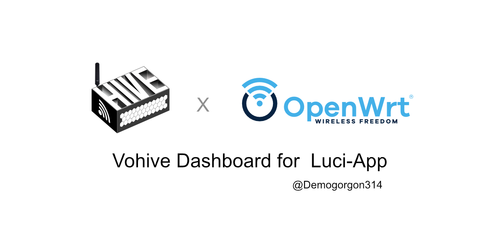

<p align="center">
  
</p>

<h1 align="center">luci-app-vohive</h1>

<p align="center">
  <strong>OpenWrt / ImmortalWrt LuCI app for VoHive</strong><br />
  Core install, service control, config management and USB driver ops from the router web UI
</p>

<p align="center">
  <a href="LICENSE"></a>
  <a href="https://openwrt.org/"></a>
  <a href="https://github.com/openwrt/luci"></a>
  
  
  <a href="https://github.com/kedaya2025/luci-app-vohive/releases"></a>
</p>

<p align="center">
  <sub>Original author / developer: <a href="https://github.com/Demogorgon314"><strong>@Demogorgon314</strong></a></sub>
</p>

<p align="center">
  English · <a href="README.zh-CN.md">简体中文</a>
</p>

<p align="center">
  <a href="#overview">Overview</a> ·
  <a href="#features">Features</a> ·
  <a href="#installation">Install</a>
</p>

---

## Overview

`luci-app-vohive` ships the official-style router-side management UI for [VoHive](https://github.com/voorz/vohive-next). After install it shows up at:

```text
LuCI → Services → VoHive
```

The plugin itself does **not** bundle the VoHive binary; install the matching `vohive-core-*` package for your arch, or pull / update / roll back the core from the GitHub Release directly within the page.

Default core release repo:

```text
https://github.com/voorz/vohive-next
```

---

## Features

| Module                 | Description                                                                        |
| ---------------------- | ---------------------------------------------------------------------------------- |
| **Core management**    | List GitHub Release versions; install / update / roll back the VoHive core         |
| **Task progress**      | Show download progress, downloaded / total size and speed                          |
| **Service control**    | Start, stop, restart the procd-based VoHive service                                |
| **Config management**  | Edit via UCI, rendered to `/etc/vohive/config/config.yaml`                         |
| **Status & logs**      | Core version, arch, service state, port listening and recent logs                  |
| **Plugin self-update** | Supports OpenWrt 24 (`opkg` / `.ipk`) and 25 (`apk` / `.apk`)                      |
| **Driver management**  | Inspect and manage USB driver bindings; mitigate 4G modules being held by `option` |
| **QMI recovery**       | Recover QMI communication so modules can self-heal after errors                    |

Roll-back keeps only the previous version and arch metadata; the old core is re-downloaded on roll-back, so **a second full binary is never stored permanently in flash**.

---

## Installation

### 1. Check system & architecture

```sh
# OpenWrt version (24.x → .ipk, 25.x → .apk)
cat /etc/openwrt_release

# Machine architecture
uname -m
```

| `uname -m`          | Core package        |
| ------------------- | ------------------- |
| `aarch64` / `arm64` | `vohive-core-arm64` |
| `x86_64` / `amd64`  | `vohive-core-amd64` |
| `armv7l` / `armv7`  | `vohive-core-armv7` |

### 2. Install the LuCI plugin only

Download the matching package from [Releases](https://github.com/kedaya2025/luci-app-vohive/releases):

**OpenWrt 24.x (opkg)**

```sh
opkg install luci-app-vohive_<version>-r1_all.ipk
```

**OpenWrt 25.x (apk)**

```sh
apk add --allow-untrusted luci-app-vohive-<version>-r1*.apk
```

Go to **Services → VoHive** and click "Install / Update core" to pull the binary.

### 3. Plugin + pre-bundled core (optional)

```sh
# Example: 24.x + arm64
opkg install luci-app-vohive_<version>-r1_all.ipk vohive-core-arm64_1.6.1-r1_all.ipk

# Example: 24.x + amd64 / armv7
opkg install luci-app-vohive_<version>-r1_all.ipk vohive-core-amd64_1.6.1-r1_all.ipk
opkg install luci-app-vohive_<version>-r1_all.ipk vohive-core-armv7_1.6.1-r1_all.ipk
```

> The service is **disabled** by default after install (`enabled=0`). Configure your account / port in LuCI, enable it, then start the service.

---

## Contributing

Issues and Pull Requests are welcome. Please describe your environment (OpenWrt version, arch, module model) when reporting.

---

## Related Links

- [VoHive core project](https://github.com/voorz/vohive-next)
- [This plugin's Releases](https://github.com/kedaya2025/luci-app-vohive/releases)
- [OpenWrt docs](https://openwrt.org/docs/start)
- [LuCI project](https://github.com/openwrt/luci)

---

## License

The LuCI plugin source in this repo is released under **MIT** (see `PKG_LICENSE` inside the package).

The VoHive **core binary** and its license follow [voorz/vohive-next](https://github.com/voorz/vohive-next); the `vohive-core-*` packages only distribute prebuilt core and do not alter upstream licensing.

---

<p align="center">
  <sub>VoHive Dashboard for LuCI-App · Built for OpenWrt</sub>
</p>
